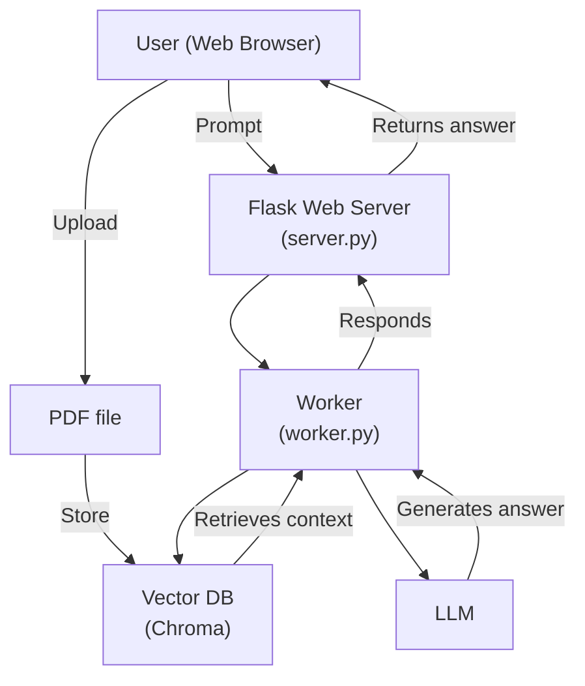

<div align="center">
  
  <h1>Simple RAG (Retrieval Augemented Generation)</h1>

  
</div>

This project is a lightweight web app for question-answering over PDFs using Retrieval Augmented Generation (RAG). Users upload a PDF, ask questions, and get answers based on the document content via a Hugging Face model.

## Table of Contents

- [Prerequirements](#prerequirements)
- [Project Structure](#project-structure)
- [Model](#model)
- [Architecture](#architecture)
- [Features](#features)
- [Installation](#installation)
- [How to get API Access Token](#how-to-get-api-access-token)
- [Usage](#usage)
- [License](#license)

## Prerequirements

-  or above: [Download here](https://python.org/downloads)
- Hugging Face account: [Sign up here](https://huggingface.co)

## Project Structure

```
simple-RAG/
├── static/
│   ├── style.css
│   └── script.js
├── templates/
│   └── index.html
├── .gitignore
├── server.py
├── worker.py
├── .env.example
├── Dockerfile
├── requirements.txt
├── LICENSE
└── README.md
```

## Model

- [HuggingFaceTB/SmolLM3-3B](https://huggingface.co/HuggingFaceTB/SmolLM3-3B) (You can use different models)

## Architecture



## Features

- Upload and query PDF documents
- RAG-powered chatbot interface
- Uses Hugging Face models
- Local semantic search with Chroma
- Light/dark mode UI

## Installation

To install this project, open your Terminal and follow these steps:

1. Clone the repository:

    ```sh
    $ git clone https://github.com/arthurtran04/simple-RAG.git
    ```

2. Change the directory to `simple-RAG`:

    ```sh
    $ cd "$(find . -type d -name "simple-RAG")"
    ```

3. Create a Python virtual environment `.venv` and install the required dependencies:

    ```sh
    $ python -m venv .venv
    source .venv/bin/activate
    pip install -r requirements.txt
    ```

4. Set up environment variables:

   ```sh
   $ cp .env.example .env
   ```

5. Configure your `.env` file:

   ```env
   # Hugging Face API Token
   HF_TOKEN=
   ```

## How to get API Access Token

<div align="center">
  <div style="display: inline-block; text-align: center; margin: 10px;">
    <p>1. Go to <a href="https://huggingface.co">Hugging Face website</a>, click your avatar and click "Access Tokens"</p>
    
  </div>
  <div style="display: inline-block; text-align: center; margin: 10px;">
    <p>2. Click "Create new token"</p>
    
  </div>
  <div style="display: inline-block; text-align: center; margin: 10px;">
    <p>3. Name your token and tick the two checkboxes in the "Inference" section</p>
    
  </div>
  <div style="display: inline-block; text-align: center; margin: 10px;">
    <p>4. Scroll down and click "Create token"</p>
    
  </div>
  <div style="display: inline-block; text-align: center; margin: 10px;">
    <p>5. Copy your Access Token before closing and paste it into the <code>HF_TOKEN</code> variable inside the <code>.env</code> file</p>
    
  </div>
</div>

## Usage

To start the application, run the `server.py` file:

   ```sh
   $ python server.py
   ```
This application will run locally at `http://127.0.0.1:5000`:
<div align="center">
  
</div>

Upload your PDF file and enter your prompt in the textbox below, and the chatbot will respond:

<div align="center">
  
</div>

To stop the application, use `Ctrl + C` in the Terminal

## License

This project is licensed under the Apache-2.0 License. See the LICENSE file for more details.
